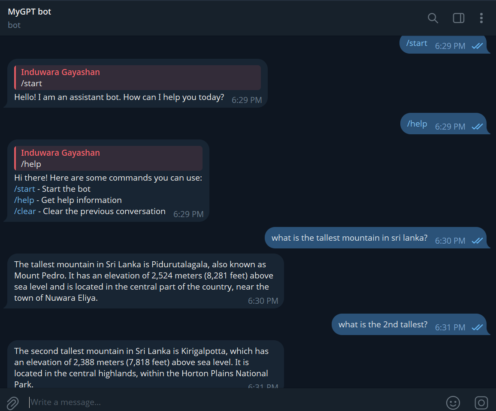

 # Telegram Chatbot with OpenAI Integration

This project is a Telegram chatbot built using [aiogram](https://docs.aiogram.dev/) and [OpenAI](https://platform.openai.com/docs/api-reference/introduction). The bot responds to user messages using OpenAI's GPT models and supports basic commands.


## Features

- Responds to user messages using OpenAI GPT-4o-mini.
- Supports `/start`, `/help`, and `/clear` commands.
- Maintains context of previous responses for conversational continuity.
- Easy to configure with environment variables.

## Setup

1. **Clone the repository**

    ```sh
    git clone <repo-url>
    cd Telegram-Chatbot
    ```
2. **Create and activate a conda environment**

    ```sh
    conda create -n telegram-bot python=3.10 -y
    conda activate telegram-bot
    ```

3. **Install dependencies**

    ```sh
    pip install -r requirements.txt
    ```

4. **Configure environment variables**

   - **Telegram Bot Token:**  
     Create your Telegram bot by chatting with [@BotFather](https://t.me/BotFather) on Telegram.
     1. Send `/start`
     2. Send `/newbot`
     3. Follow the prompts to give your bot a name and a username
     4. Copy the token provided by BotFather

   - **OpenAI API Key:**  
     You can use a GitHub access token as the API key for the OpenAI client in this project. See [here](https://github.com/marketplace/models/azure-openai/gpt-4o-mini) for more details.

   - **Create a `.env` file** in the root directory with the following content:

     ```
     TELEGRAM_BOT_TOKEN="your-telegram-bot-token"
     OPENAI_API_KEY="your-github-access-token"
     ```
## How to Run

After completing the setup steps above, you can start the bot with:

   ```sh
    python main.py
   ```

The bot will start polling for messages on Telegram. Make sure your `.env` file is properly configured before running.


## Usage

- `/start` - Start the bot and get a welcome message.
- `/help` - List available commands.
- `/clear` - Clear the previous conversation context.



